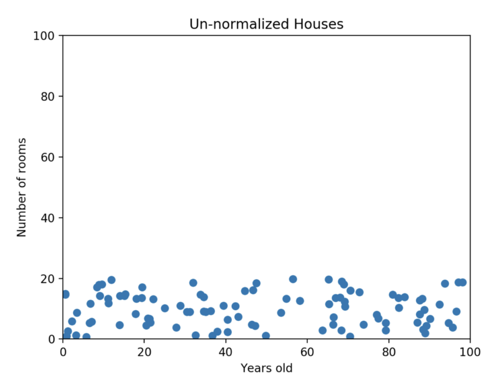
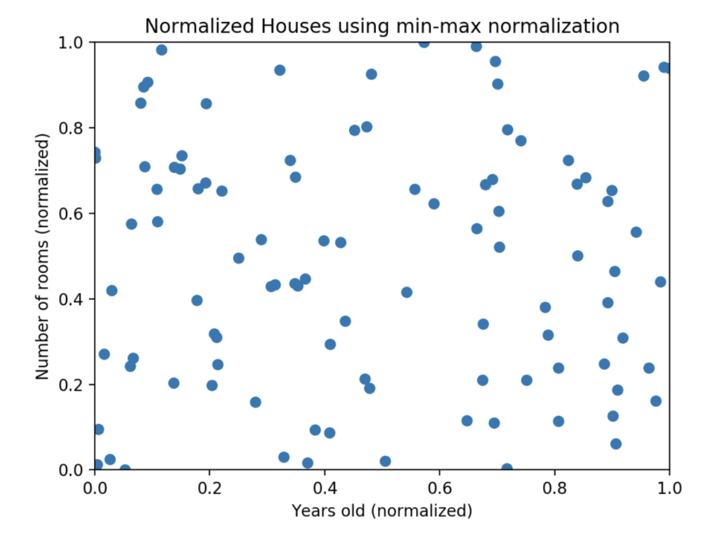
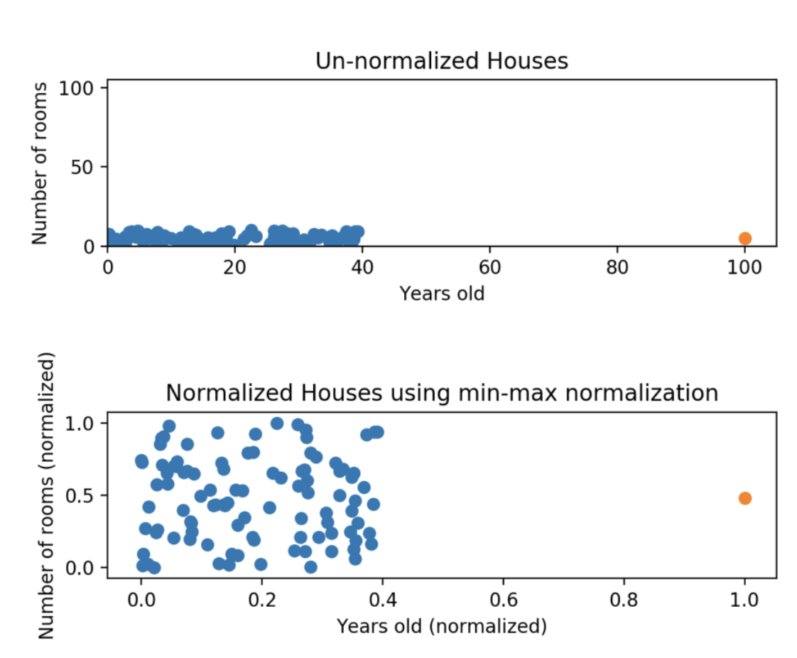
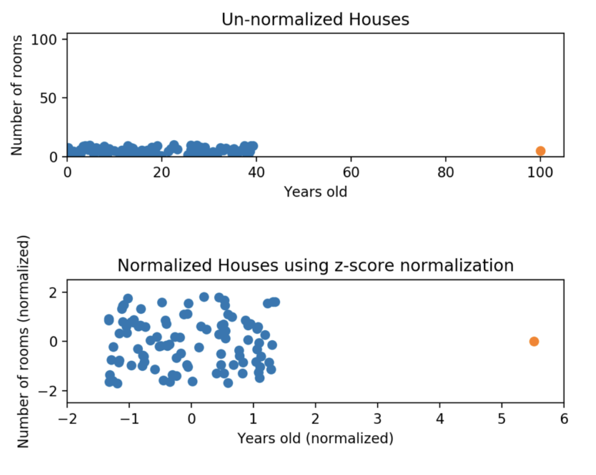

# 정규화

<a href = 'https://hleecaster.com/ml-normalization-concept/'>참고링크</a>

## 왜 정규화를 해야 하는가?
데이터가 가진 Feature의 스케일이 심하게 차이가 나는 경우, 문제가 되기 때문이다.

예를 들어 ‘주택’에 관한 정보가 담긴 데이터를 생각해보자. 그 안에 feature로 방의 개수(개), 얼마나 오래 전에 지어졌는지(년) 같은 것들이 포함될 수 있을 거다. 그리고 여기서 머신러닝 알고리즘을 통해 어느 집이 가장 적합한지 예측을 시도한다고 해보자. 그러면 각 데이터 포인트를 비교할 때 더 큰 스케일을 가진 feature, 즉 얼마나 오래 전에 지어졌는지(년)에 따라 그 데이터가 완전히 좌지우지 되는 꼴이다.

아래 그림을 보면 이해가 쉬울 것 같다.

</img>

머신러닝 알고리즘이 집 가격을 예측하는 데이터 같은 경우, 방이 1개 있는 집과 방이 20개 있는 집이 얼마나 차이가 있는지(가격에 얼마나 영향을 미치는지?) 인식하기를 바라는데

그림에서 보듯, 만약 두 집이 비슷한 시기에 지어졌을 경우 두 데이터 포인트가 매우 가깝게 위치하게 된다.  
```
근데, 가격이 안나와서 그렇지 3차원으로 본다면, 가격차이가 커서 거리가 멀리 떨어져 있을 수도 있지 않을까??
```


결론적으로, 모든 데이터 포인트가 동일한 정도의 스케일(중요도)로 반영되도록 해주는 게 정규화(Normalization)의 목표고, 측도를 동일하게 맞춰주는 것이다. 단위를 제외한, 숫자만을 생각 할 때. 1과 100의 차이와 1과 2의 차이는 99배가 차이가 나게된다. 이를 동일한 크기로 맞춰주면서 데이터의 분포는 유지되게 만드는 방법이 `Normalization`이다.

위 데이터를 __MIN-MAX 정규화__ 하면 아래와 같이 나타난다.  
</img>


대표적으로 자주 쓰이는 방법에는 2가지가 있다.
- Min-max 정규화
- Z-score 정규화

각각의 장단점이 있기 때문에 정확히 이해하고 언제 어떤 방식으로 정규화를 할지 결정할 수 있어야 한다.

## 1. MIN-MAX Normalization
모든 feature에 대해 각각 최소값 0, 최대값 1로 0과 1사이의 값으로 변환 하는 것.

예를들면, 어떤 Feature $(X_k)$의 데이터가 최소값이 20이고 최대값이 40인 경우 30은 딱 중간이므로 0.5로 변환되고 20은 0, 40은 1로 변환이 되는 방식이다.

$$scaled(X) = \cfrac{(X- MIN)}{(MAX-MIN)}$$

그런데, 최대 최소 정규화에는 치명적인 단점이 있다. __이상치(outlier)에 너무 많은 영향을 받는다__ 는 거다.

</img>  

위 그림을 보면, y축에대해서는 정규화가 효과적으로 적용되었지만, x축에는 여전히 문제가 있다. (0과 0.4 사이에 데이터로 찌그러지면서 Y축 스케일이랑 같게 만들지 못하고 있음.)  
이러한 단점을 보완하기 위해 __Z-score Normalization__ 을 고려하게 된다.

## 2. Z-score Normalization
Z-score 정규화는 이상치(outlier) 문제를 해결할 수 있는 데이터 정규화 전략이다.

X라는 값을 Z-score로 바꿔주는 식은 고등학교 수학시간에 평균과 표준편자를 배우면서 다루어 봤던 익숙한 식이다.

<script type="text/javascript" 
src="https://cdn.mathjax.org/mathjax/latest/MathJax.js?config=TeX-AMS_HTML"> scaled(X) = \cfrac{(X- 평균)}{(표준편차)} 
</script>
다들 알다시피, 표준편차(분산)이 크면 정규화 되는 값들이 평균에 몰려있게 된다. (뾰족한 정규분포)

아래 그림을 보면, 최대-최소 정규화에서 예로 들었던 데이터지만 Z-score 정규화를 사용했을 때, X축도 -2 ~ 2 사이값 Y축도 -2 ~ 2 사이값으로 바교적 적절한 스케일로 변환된 것을 확인할 수 있다.
</img>


음.. 근데 의문점이 하나 든다.  
`Y = w1X1 + w2X2 + w3X3...` 라는 식을 만족할 때 특정 Feature인 X1의 가중치가 99가 되고 X2의 가중치는 1 이 될 수도 있다는 얘기인데,  
뭐 심하다면, `Y = 1000X1 + 0.000000001X2...` 가 될 수도 있겠지

근데,, 사실 이게 뭐가 문제일까? 나도 거기까진 잘 이해가 안간다.  
`Y = 100X1 + 0.00000001X2 ...` 로 식이 찾아진다면, 그만큼 X2의 영향도가 없다고 봐도 되는거 아닐까..?

이에 대해서, 원작자 분은 이렇게 설명한다. 아직은 이해가 잘 안가지만, 좀 더 생각을 해봐야 할 것 같다.

데이터 정규화는 머신러닝에서 꼭 알아야 하는 개념이다. 매우 훌륭한 데이터를 가지고도 정규화를 놓치면 __특정 feature가 다른 feature들을 완전히 지배할 수 있기 때문__ 이다. 거의 모든 정보를 버리는 꼴이니까! 어쨌든 정규화는 아래 두 가지 방법을 적절히 사용해자.

## 요약
- 최소 최대 정규화: 모든 feature들의 스케일이 동일하지만, 이상치(outlier)를 잘 처리하지 못한다.
- Z-점수 정규화 : 이상치(outlier)를 잘 처리하지만, 정확히 동일한 척도로 정규화 된 데이터를 생성하지는 않는다.


