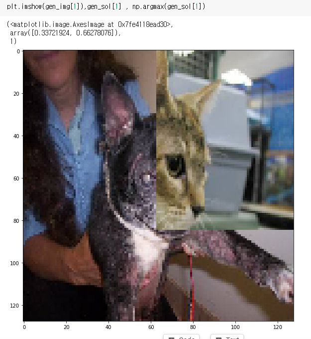
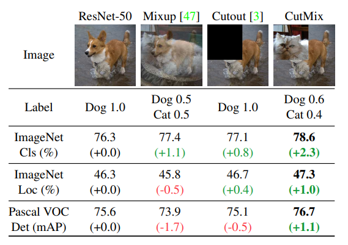
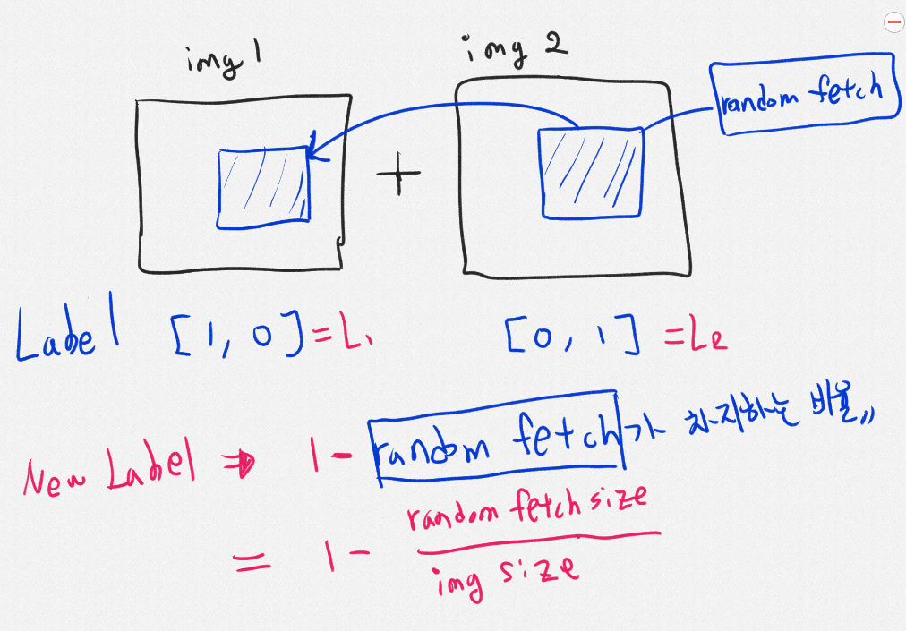

# Data Agumetation - ICCV 2019 Cutmix (Naver) 구현

  

## 개요

이미지 부풀리기 최신논문버전 ICCV 2019에서 Naver연구팀이 발표한 CutMix 라는 논문에 대해 구현합니다.

<a href = "http://openaccess.thecvf.com/content_ICCV_2019/papers/Yun_CutMix_Regularization_Strategy_to_Train_Strong_Classifiers_With_Localizable_Features_ICCV_2019_paper.pdf"> Cutmix 관련논문링크 </a>

> __Note__
> < 글쓴이가 이해한대로 구현했으므로 완벽하게 구현된 내용이 아닐 수 있습니다 >

  

일단 CutMix란 기존의 MIXUP 과 CutOut이라는 방법이 있었는데... 부터 시작합니다. 논문에서 따온 그림인데 아래를 보면 대충 어떤느낌인지 감이 오실겁니다. 논문에서는 Mixup과 상당히 유사한 방법이다라고 설명합니다. 

MIXUP 은 이 링크를 참고 바랍니다.

<a href = "https://blog.naver.com/kmh03214/221746604279"> Mixup 설명 </a>

## CutMix Idea 

  

간단하게 Cutmix를 아이디어를 설명해 보자면, 

1) img1과 img2를 Random Sampling을 합니다.

2) img2에서 Random fetch(전체에서 임의의 영역을 자른부분영역) 를 copy해서 img1의 같은 위치의 영역에 붙여줍니다. 가 끝입니다.

물론, 세부적으로는 random fetch를 뽑는 방법의 (x1,x2,w1,h1)의 random fetch의 중심좌표인 x1과 x2는 uniformly분포를 따르고 비율은 beta(a,a) 분포에서 뽑고 a = 1로 만들어서 합니다. 

또한, 이에 대한 라벨링은 crop된 ratio의 비율에 맞춰 정의해줍니다.  

사람은 물체의 특징적인 부분만 보고 분류할 수 있는데, CNN 또한 이와 비슷하고,  

Cutout같은 경우 Regional Dropout으로서, 학습이미지에서 유용한 픽셀들을 없애는 단점이 있는데,  

CutMix는 이러한 유용한 픽셀을 다른 이미지로 대체함으로서, 부분적인 부분만 보고 유추할 수 있게 도움을 줌과 동시에 유용하지 않은 픽셀이 없도록 만들어주도록 보완한 Agumentation 방법 이라고 설명합니다.