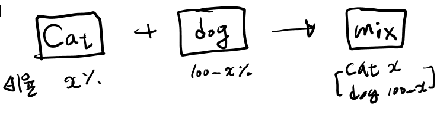

# Data Agumetation - Mixup: Beyond empirical risk minimization.

  

## 개요

이미지 부풀리기 Mixup 이라는 논문에 대해 구현합니다.

<a href = "https://arxiv.org/pdf/1710.09412.pdf"> Mixup 관련논문링크 </a>

> __Note__
> < 글쓴이가 이해한대로 구현했으므로 완벽하게 구현된 내용이 아닐 수 있습니다 >

## Mixup Idea 

Mixup은 두 데이터의 이미지와 label을 각각 weighted linear interpolation 하여 새로운 sample을 생성하는 기법인데요. 쉽게 설명하자면

  

총 100개중 x만큼 Cat 나머지 100-x 만큼은 Dog 이미지의 비율을 넣는 겁니다.

(고등학교 1학년 때 배웠던 내분점 공식과 비슷)  